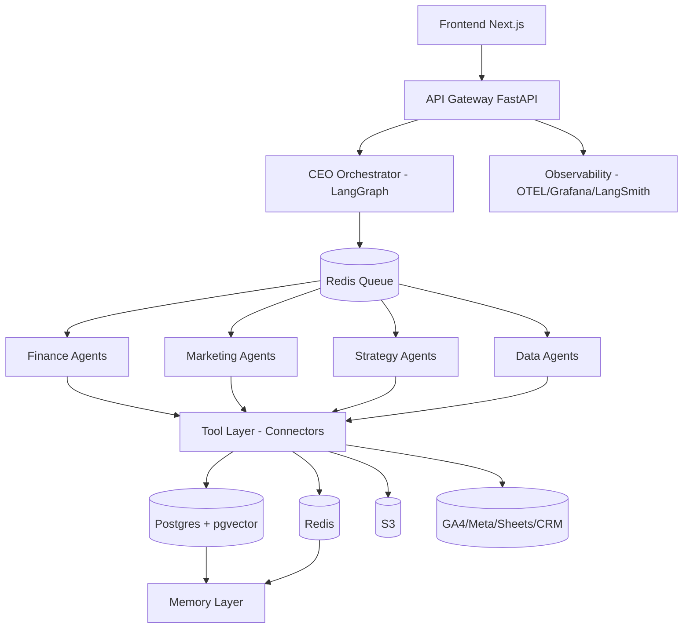
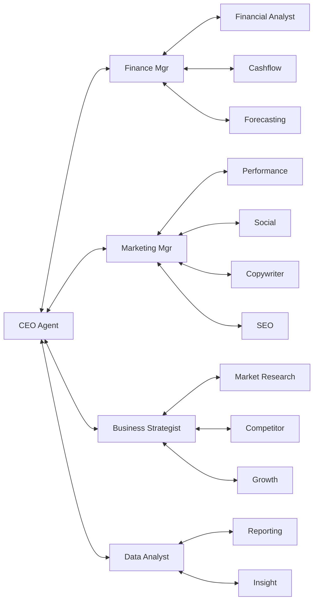
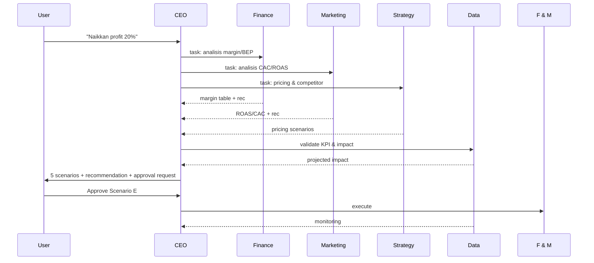
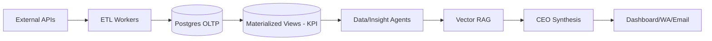
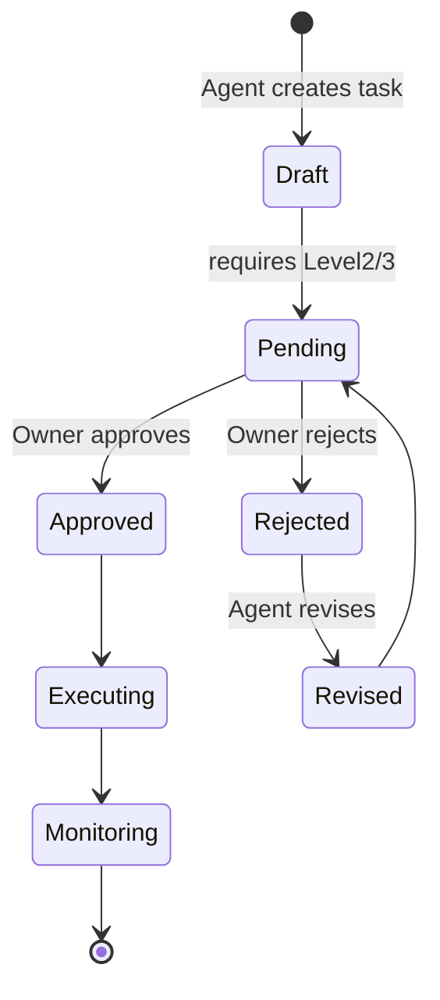
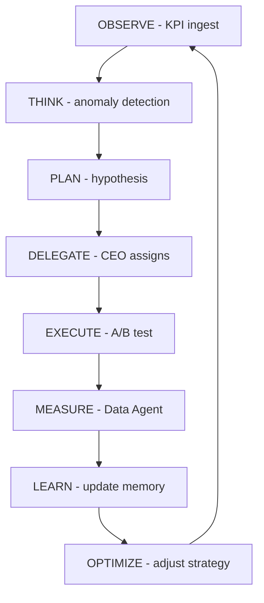

# PRD LENGKAP — AGENTIC AI BUSINESS OPERATING SYSTEM (AI Company OS)
> Satu AI Company yang membantu Anda mengelola keuangan, marketing, strategi, dan pertumbuhan bisnis.

**Versi:** 1.0 — 05 September 2026  
**Owner:** Product + AI Architect  
**Status:** Ready for Development (MVP → Autonomous OS)  
**Audience:** PM, UI/UX Designer, AI Engineer, Backend, Frontend, DevOps

---

## DAFTAR ISI
1. Executive Summary
2. Product Vision
3. Problem Statement
4. Goals & Non-Goals
5. User Personas (4)
6. User Journey
7. AI Organization Structure
8. Agent Responsibilities (16 Agent Specs)
9. Agent Interaction Model + Matrices
10. Agentic Workflow
11. Functional Requirements
12. Non-Functional Requirements
13. AI Architecture
14. System Architecture
15. Data Architecture
16. Memory Architecture
17. Knowledge Base (RAG)
18. Database Schema (ERD)
19. API Design
20. Event Architecture
21. Permission System (RBAC)
22. Human-in-the-Loop
23. AI Guardrails
24. KPI Framework
25. Dashboard
26. Reporting
27. Automation
28. Error Handling
29. Observability
30. AI Cost Management
31. Security
32. Integration Strategy
33. MVP Scope (3 Phase)
34. User Stories (30+)
35. Acceptance Criteria (Gherkin)
36. Technical Roadmap
37. Product Roadmap
38. Future Development (Autonomous OS)
39. Risks & Mitigation
40. Success Metrics
41. Appendix: Mermaid Diagrams, State Machine, Task Schema, Decision Engine, Health Score

---

## 1. EXECUTIVE SUMMARY

Platform **Agentic AI Business Operating System** adalah organisasi AI otonom yang terdiri dari 16 agent spesialis dalam 4 departemen (Finance, Digital Marketing, Business Strategy, Data & Intelligence) yang di-orkestrasi oleh **CEO Agent**. Berbeda dengan chatbot, sistem ini memiliki shared memory, task management, approval layer manusia, KPI monitoring, dan decision support dengan confidence scoring.

**Positioning:** "Tim bisnis AI Anda — bukan sekadar chat, tapi CEO + Finance + Marketing + Strategy + Analyst yang bekerja 24/7, lapor tiap pagi, dan minta approval sebelum eksekusi berisiko."

**MVP (Phase 1 - 10-12 minggu):** CEO Orchestrator, Finance Manager + Financial Analyst, Marketing Manager, Data Analyst/Reporting. Integrasi Google Sheets + Meta Ads + GA4. Dashboard Executive + Daily Briefing via WhatsApp/Email.

**Production target:** <2s p95 API, 99.5% uptime, biaya AI <5% revenue user UMKM, hallucination rate <2% (diukur via grounded citations).

---

## 2. PRODUCT VISION

### 2.1 Masalah
- 78% UMKM tidak punya tim lengkap (finance, marketing, strategy). Keputusan berbasis feeling.
- Data tersebar: omzet di marketplace, ads di Meta/Google, cashflow di spreadsheet.
- Chatbot generik tidak bisa: delegasi task, cross-check antar domain, monitoring KPI, minta approval.

### 2.2 Target Pengguna
Primer: Business Owner & Entrepreneur UMKM (omzet Rp50jt-5M/bulan, 5-100 karyawan). Sekunder: Marketing Manager & Finance Manager di SME.

### 2.3 Value Proposition
- **Observe → Think → Plan → Delegate → Execute → Measure → Learn → Optimize** loop otomatis.
- CEO Agent pecah objective ("naikkan profit 20% dalam 3 bulan") menjadi task terukur lintas departemen.
- Rekomendasi selalu dengan: Data + Assumption + Expected Impact + Risk + Confidence + Alternatives.

### 2.4 Organisasi AI vs Chatbot Biasa
| Chatbot Biasa | AI Company OS |
|---|---|
| 1 LLM, 1 thread | 16 agent spesialis + CEO orchestrator |
| Jawab pertanyaan | Pecah objective → buat workflow → eksekusi → monitor |
| Stateless | Shared Memory (Business/Financial/Marketing/Decision/Episodic) |
| Tidak ada approval | Human-in-the-Loop 3 level |
| Angka tanpa insight | Insight = "So what?" + Recommendation |

### 2.5 Keunggulan Multi-Agent
- Spesialisasi: Finance tidak mengarang copy ads; Copywriter tidak menghitung BEP.
- Validasi silang: Marketing proposal budget → Finance cek runway → Strategy cek positioning.
- Scalability: tambah agent = tambah departemen tanpa retrain monolitik.

### 2.6 Pengambilan Keputusan
Decision Engine memaksa setiap rekomendasi punya: Problem, Data (sumber), Analysis, Assumption, Recommendation, Expected Impact (kuantitatif), Risk, Confidence (0-100), Alternatives, Required Approval.

### 2.7 Menuju Autonomous Business OS
Phase 5: CEO menjalankan autonomous loop harian (cek KPI → deteksi anomaly → buat hypothesis → A/B test → ukur → update strategy) dengan batasan guardrails + budget harian.

---

## 3. PROBLEM STATEMENT

- P1: Owner tidak tahu produk mana paling profitable (COGS tidak terhubung ke ads cost).
- P2: Marketing spend naik 24% tapi revenue naik 5% — tidak terdeteksi 3 minggu.
- P3: Tidak ada forecast cashflow → telat gaji / stockout.
- P4: Strategi copy-paste kompetitor tanpa market research.
- P5: Laporan manual 6 jam/minggu.

Jobs-to-be-Done: "Bantu saya tahu kondisi bisnis pagi ini, apa yang harus dilakukan hari ini, dan apa dampaknya ke profit."

---

## 4. GOALS & NON-GOALS

### Goals (12 bulan)
- G1: Kurangi waktu reporting 80%
- G2: Deteksi anomaly cashflow/marketing <6 jam
- G3: 70% rekomendasi memiliki confidence >70% dengan sumber data jelas
- G4: Approval rate rekomendasi >40% (menandakan relevan)
- G5: Business Health Score adoption >60% DAU

### Non-Goals (MVP)
- Bukan pengganti akuntan legal / auditor
- Bukan eksekutor transaksi keuangan besar (Level 3 Human Only)
- Bukan autopilot tanpa approval untuk perubahan harga/budget >15%
- Tidak mengklaim akses bank langsung di MVP (via import/manual sync dulu)

### OPEN PRODUCT DECISION
- OPD-1: Apakah MVP perlu auto-posting sosial media? Opsi A: draft-only (aman, butuh approval) vs Opsi B: auto-post jam tertentu (cepat, risiko brand). Rekomendasi: Opsi A untuk MVP.
- OPD-2: Single-tenant vs multi-tenant vector DB per organization? Opsi A multi-tenant + row filter (murah) vs Opsi B index per org (isolasi lebih kuat). Rekomendasi: A untuk MVP, B untuk enterprise tier.

---

## 5. USER PERSONAS

### Persona 1 — Budi, Business Owner (38, Fashion Retail, omzet 800jt/bln)
- Needs: monitoring, P&L, strategi, marketing ROI, rekomendasi harian
- Pain: Data di 4 tempat, keputusan telat, takut salah naikin harga
- Goal: Profit +20% dalam 3 bulan tanpa tambah headcount
- Behavior: Cek HP pagi, suka ringkasan 3 poin, butuh approval 1-tap

### Persona 2 — Sinta, Marketing Manager (29, Beauty Brand)
- Needs: campaign planning, ads, social, SEO, copy, analytics
- Pain: Brief ke copywriter lama, tidak tahu ROAS per produk, A/B test berantakan
- Goal: CAC <35rb, ROAS >3.5
- Behavior: Kerja di Meta Ads Manager + Sheets, butuh content calendar drag-drop

### Persona 3 — Andi, Finance Manager (34, F&B)
- Needs: cashflow, revenue, HPP, margin, budgeting, forecasting
- Pain: Forecast manual, tidak tahu runway, budget marketing tidak terkontrol
- Goal: Cash runway >90 hari, gross margin >45%
- Behavior: Mahir spreadsheet, butuh export & audit trail

### Persona 4 — Rina, Entrepreneur UMKM (26, Kerajinan, omzet 45jt/bln)
- Needs: otomatisasi, insight sederhana, rekomendasi, marketing, financial planning
- Pain: Tidak ada tim, tidak ngerti istilah CAC/ROAS
- Goal: Naikkan order 30% dengan budget 3jt
- Behavior: Bahasa sederhana, butuh insight "So what?", suka template siap pakai

---

## 6. USER JOURNEY

### Journey Owner (dari onboarding → autonomous)
1. Onboarding (15 menit): isi Business Profile (nama, industri, produk, harga, HPP, target market) → connect Sheets/GA4/Meta (optional) → define goals (profit, revenue).
2. Day 1: CEO beri Health Score + 3 insights awal (bahkan tanpa integrasi, via estimasi).
3. Daily: 07:00 Daily Briefing (Yesterday/Today/Insights/3 Recommendations) via dashboard + WhatsApp.
4. Ask: "Kenapa profit turun?" → CEO delegasi → Finance + Data analisa → jawab dengan sumber.
5. Plan: "Naikkan profit 20%" → CEO buat 5 scenario → minta approval → eksekusi → monitor KPI.
6. Weekly: Review Minggu + Top 3 Wins/Problems/Opportunities/Actions.

Journey Marketing/Finance serupa tapi entry point via department chat.

---

## 7. AI ORGANIZATION STRUCTURE

```
CEO / Chief AI Agent (Orchestrator, Decision Synthesizer)
│
├── Finance Department
│   ├── Finance Manager Agent (planning, budget, KPI, strategy)
│   ├── Financial Analyst Agent (revenue, COGS, margin, BEP, CAC/LTV)
│   ├── Cashflow Analyst Agent (inflow/outflow, runway, liquidity)
│   └── Financial Forecasting Agent (revenue/expense/profit, scenario best/base/worst)
│
├── Digital Marketing Department
│   ├── Marketing Manager Agent (strategy, budget, channel, coordination)
│   ├── Performance Marketing Agent (Google/Meta/TikTok Ads, ROAS/CAC/CTR/CPC/funnel)
│   ├── Social Media Specialist Agent (content pillar, calendar, IG/TikTok/FB/LinkedIn/X)
│   ├── Copywriter Agent (AIDA/PAS/BAB, ads copy, caption, LP, email)
│   └── SEO Specialist Agent (keyword, topical authority, on-page, brief)
│
├── Business Strategy Department
│   ├── Business Strategist Agent (model, pricing, expansion, segmentation)
│   ├── Market Research Agent (size, trend, demand)
│   ├── Competitor Analyst Agent (pricing, positioning, SWOT)
│   ├── Business Analyst Agent (process, bottleneck)
│   └── Growth Strategy Agent (acquisition, retention, upsell, referral)
│
└── Data & Intelligence Department
    ├── Data Analyst Agent (collection, cleaning, anomaly/trend)
    ├── Reporting Agent (daily/weekly/monthly, executive report)
    └── Insight Agent (So what? + recommendation)
```

Hubungan kerja: CEO hub-and-spoke. Finance ↔ Marketing (budget), Marketing ↔ Strategy (target market), Semua → Data (KPI), Strategy ↔ Finance (pricing impact).

---

## 8. AGENT RESPONSIBILITIES — SPEC LENGKAP (16 AGENT)

Format per agent: Role | Objective | Responsibilities | Input | Output | Tools | Knowledge | Memory R/W | Decision Authority | Permission | KPI | Collaborators | Escalation | Approval

### 8.1 CEO / Orchestrator Agent
- Objective: Ubah objective user menjadi workflow terukur dan eksekusi terkontrol
- Responsibilities: 13 langkah (minta data, pecah task, prioritaskan, gabung output, cross-check, buat scenario, rekomendasi, action plan, approval, eksekusi, monitoring, optimization, executive summary)
- Input: user objective (NL), Business Profile, KPI snapshot
- Output: Task Graph (DAG), Recommendation Packet (dengan confidence), Executive Summary
- Tools: task.create, workflow.create, memory.read/write, approval.request, KPI.read, agent.delegate
- Knowledge: SOP bisnis, prior decisions, business goals
- Memory: R/W semua (orchestrator only yang boleh write Decision Memory final)
- Authority: delegasi & sintesis; tidak boleh eksekusi Level 3 tanpa approval
- KPI: task completion rate, recommendation approval rate, workflow latency
- Collaborators: semua
- Escalation: jika confidence <50% atau data missing → minta data / human review
- Approval: wajib untuk budget>15%, pricing change, campaign launch

### 8.2 Finance Manager Agent
- Responsibilities: planning, budgeting, monitoring, profit/cost analysis, KPI, strategy
- Input: transactions, budget, forecast
- Output: budget plan, variance report, KPI dashboard
- Tools: sheets.read, accounting API, forecast.tool
- KPI: budget variance <10%, forecast accuracy MAPE <15%
- Collaborators: Financial Analyst, Cashflow, Forecasting, Marketing Manager (budget), CEO

### 8.3 Financial Analyst Agent
- Menganalisis: revenue, COGS/HPP, gross/net profit, margin, BEP, contribution margin, CAC, LTV, BEP = Fixed Cost / (Price - Variable Cost)
- Output: margin table per produk, BEP, CAC/LTV, jawaban 7 pertanyaan Finance Team (apakah untung? produk paling profitable? dll)
- Tools: data.query, calculator, cohort analysis

### 8.4 Cashflow Analyst Agent
- Tasks: inflow/outflow, balance, forecast 13 minggu, liquidity, warning (runway <30 hari = Critical)
- Output: cashflow statement, runway, alert

### 8.5 Financial Forecasting Agent
- Output: 3-month forecast (best/base/worst), scenario "iklan naik 30% → profit -8% jika CAC tetap"
- Guardrail: label ASSUMPTION vs FACT jelas

### 8.6 Marketing Manager Agent
- Input: objective "Naikkan revenue 30%" → pecah ke Performance/Social/Copy/SEO
- Output: channel strategy, budget allocation, campaign coordination, KPI

### 8.7 Performance Marketing Agent
- Channel: Google/Meta/TikTok, audience, budget, CAC/ROAS/CTR/CPC/funnel, A/B test
- Output: campaign structure (objective, audience, budget, creative brief, KPI, testing plan)
- Example: budget 10jt → 50% Meta prospecting, 30% retargeting, 20% Google Search; butuh validasi Finance (budget aman) & Strategy (target market) & Data (historical ROAS)

### 8.8 Social Media Specialist Agent
- Output: monthly calendar, weekly plan, daily ideas, reels/carousel concepts, engagement strategy
- Considers: audience, brand voice, funnel, historical, trend, competitor

### 8.9 Copywriter Agent
- Frameworks: AIDA, PAS, BAB, FAB, Storytelling, Social Proof, Urgency, Scarcity
- Output: ads copy, caption, LP copy, email, headline, CTA, script video — disesuaikan platform/audience/funnel/brand voice
- Tool: brand_guideline RAG

### 8.10 SEO Specialist Agent
- Output: keyword cluster, topic cluster, roadmap, brief, meta title/description, schema, priority
- Tools: GSC, GA4, SERP API (optional MVP: manual import)

### 8.11 Business Strategist Agent
- Tasks: business model, growth, pricing (elasticity check), product, expansion, segmentation
- Output: strategic options dengan impact/effort matrix

### 8.12 Market Research Agent
- Output: market size (TAM/SAM/SOM est.), needs, trends — label ESTIMATION jika data terbatas

### 8.13 Competitor Analyst Agent
- Output: pricing/positioning/product/marketing SWOT, differentiation

### 8.14 Business Analyst Agent
- Output: bottleneck analysis, process map

### 8.15 Growth Strategy Agent
- Output: acquisition/retention/upsell/cross-sell/referral/partnership playbook

### 8.16 Data & Intelligence (3 agent digabung spec)
- Data Analyst: collection/cleaning/anomaly/trend (z-score, WoW delta >20% flag)
- Reporting: daily/weekly/monthly templates (Summary→Data→Insight→Problem→Opportunity→Recommendation→Action Plan)
- Insight: "So what?" — Revenue turun 15% karena CR 3.2→2.1% → Recommendation: audit LP campaign terendah

---

## 9. AGENT INTERACTION MODEL + MATRICES

### 9.1 Task → Agent → Result → Validation → Next Agent → Final Decision
Setiap komunikasi pakai envelope standar:
```json
{
  "task_id": "tsk_...",
  "sender": "ceo_agent",
  "receiver": "finance_analyst_agent",
  "objective": "Analisis margin per produk Q1",
  "context": {"business_id": "biz_123", "period": "2026-01..2026-03"},
  "input_data": {"revenue_csv": "s3://...", "assumptions": []},
  "expected_output": {"type": "margin_table", "fields": ["product","revenue","cogs","margin"]},
  "priority": "high",
  "deadline": "2026-09-06T10:00:00+07:00",
  "confidence_score": null,
  "result": null,
  "recommendation": null,
  "evidence": [],
  "status": "assigned"
}
```

### 9.2 Agent Capability Matrix
| Agent | Analisis | Planning | Forecasting | Content | Optimization | Reporting | Forecasting Budget |
|---|---|---|---|---|---|---|---|
| CEO | H | H | M | L | M | H | H |
| Finance Manager | H | H | H | L | M | H | H |
| Financial Analyst | H | M | M | L | L | H | M |
| Cashflow Analyst | H | M | H | L | L | H | H |
| Forecasting | M | H | H | L | L | M | H |
| Marketing Manager | H | H | M | M | H | H | M |
| Performance Mkt | H | H | M | M | H | H | M |
| Social Media | M | H | L | H | M | M | L |
| Copywriter | L | M | L | H | M | L | L |
| SEO | H | H | L | H | M | M | L |
| Business Strategist | H | H | M | L | M | M | M |
| Market Research | H | M | M | L | L | M | L |
| Competitor Analyst | H | M | L | L | M | M | L |
| Growth | H | H | M | M | H | M | M |
| Data Analyst | H | L | M | L | H | H | L |
| Insight | H | L | L | L | M | H | L |
H=High M=Medium L=Low

### 9.3 Agent Interaction Matrix (siapa ke siapa)
- CEO ↔ semua (hub)
- Finance Manager ↔ Financial Analyst, Cashflow, Forecasting, Marketing Manager, Data
- Marketing Manager ↔ Performance, Social, Copywriter, SEO, Finance Manager, Strategy, Data
- Performance ↔ Copywriter, Social, Data, Finance
- Strategy ↔ Market Research, Competitor, Growth, Finance, Marketing Manager
- Data ↔ semua (subscribe events)

### 9.4 RACI (tugas utama)
| Tugas | Responsible | Accountable | Consulted | Informed |
|---|---|---|---|---|
| Pecah objective jadi task | CEO | CEO | - | User |
| Analisis margin/BEP | Financial Analyst | Finance Manager | Data | CEO |
| Tentukan budget marketing aman | Finance Manager | CEO | Cashflow | Marketing Mgr |
| Buat campaign structure | Performance | Marketing Mgr | Copywriter, Finance | CEO, Data |
| Buat content calendar | Social | Marketing Mgr | Copywriter, Strategy | CEO |
| Validasi target market | Strategy | CEO | Market Research | Marketing Mgr |
| Deteksi anomaly | Data Analyst | CEO | - | Semua |
| Rekomendasi final | CEO | CEO | Finance/Mkt/Strategy | User |
| Approval budget/pricing | User (Human) | CEO | Finance | - |

---

## 10. AGENTIC WORKFLOW

### 10.1 Engine Generik
```
USER OBJECTIVE → CEO AGENT → TASK DECOMPOSITION (DAG) → PARALLEL: Finance/Marketing/Strategy (+ Data)
→ DATA ANALYSIS → CROSS-AGENT VALIDATION → CEO SYNTHESIS → RECOMMENDATION PACKET → HUMAN APPROVAL
→ EXECUTION → MONITORING (KPI/anomaly) → OPTIMIZATION LOOP
```

### 10.2 Contoh: Meningkatkan Profit 20%
1. CEO minta: revenue, HPP, Opex 3 bulan (via Sheets/API)
2. Finance: margin per produk, expense breakdown, BEP
3. Marketing: CAC, ROAS, CR per campaign
4. Strategy: pricing elasticity, product mix, competitor price
5. CEO gabung → 5 scenario: A Naikkan harga 13% (impact +12% gross), B Turunkan HPP 8% (nego supplier), C Naikkan volume 25% (butuh +30% ads), D Optimasi ROAS (cut losers), E Kombinasi (rekomendasi: A+D → +21% profit, risk medium, confidence 72%)
6. Hitung projected impact kuantitatif + runway + CAC constraint
7. Minta approval → eksekusi → monitor weekly

### 10.3 Contoh: Campaign Penjualan
1. Strategy tentukan target market (persona + segment)
2. Finance tentukan budget aman (max 12jt, rule: marketing <=20% revenue)
3. Marketing Mgr buat channel strategy
4. Performance buat ads strategy + audience + budget
5. Social buat organic + calendar
6. Copywriter buat copy (AIDA per funnel)
7. SEO buat organic capture
8. Data tentukan KPI primary: CAC<35rb, secondary ROAS>3
9. CEO validation → User approval → Launch → Data monitoring hourly → Performance optimization (pause losers) → Weekly report

---

## 11. FUNCTIONAL REQUIREMENTS

FR format: Objective, User Flow, AI Behavior, Input, Output, Dependency, API, DB, Permission, Error, Acceptance.

- FR-1 Onboarding Business Profile (wajib sebelum workflow)
- FR-2 CEO Task Decomposition (DAG dengan dependencies & priority)
- FR-3 Shared Memory CRUD + versioning
- FR-4 Agent Communication Envelope (JSON di §9)
- FR-5 Approval Workflow 3-level
- FR-6 Daily Briefing 07:00 scheduler
- FR-7 Weekly Business Review (auto tiap Senin 08:00)
- FR-8 Financial Analysis (margin/BEP/CAC/LTV)
- FR-9 Cashflow Forecasting 13 minggu + alert
- FR-10 Campaign Planning (budget allocation + creative brief)
- FR-11 Content Calendar (monthly → weekly → daily)
- FR-12 Copy Generation (framework selector)
- FR-13 SEO Research (keyword cluster)
- FR-14 Competitor/Market Research (RAG + web search)
- FR-15 Reporting (8 jenis report template §26)
- FR-16 Business Health Score 0-100
- FR-17 Decision Engine (10-field recommendation)
- FR-18 KPI Monitoring + threshold alert
- FR-19 Integration Connectors (OAuth, sync frequency)

Detail per FR ada di API & DB sections.

---

## 12. NON-FUNCTIONAL REQUIREMENTS

- Performance: p95 <2s chat, <5s workflow synthesis; dashboard <1.5s
- Availability: 99.5% (MVP), 99.9% production
- Scalability: 10k org, 100k tasks/day, horizontal agent workers via queue
- Security: SOC2-ready, encryption at rest (AES-256), in transit TLS1.3, RBAC, audit log
- Explainability: setiap angka punya source + timestamp + agent
- Cost: AI cost per org < Rp150rb/bulan di MVP (via routing)
- Data Accuracy: no hallucinated numbers — jika estimasi, label ESTIMATION + confidence <70%
- Latency AI: streaming token, partial results via SSE

---

## 13. AI ARCHITECTURE

- Orchestrator: CEO Agent (LLM GPT-4 class untuk reasoning + tool use)
- Department Agents: Mixtral/GPT-4o-mini tier sesuai complexity (router)
- Tools: function calling (sheets, ads APIs, DB, memory, approval)
- RAG: Vector DB (pgvector/Qdrant) + structured DB (Postgres)
- Memory: Redis (short/working), Postgres + pgvector (long-term/episodic/decision)
- Guardrails: input validation, output fact-check (cite source), confidence gate, PII redaction
- Evaluations: golden dataset per agent, auto-eval tiap deploy

Model Routing (§30): cheap untuk draft/summarize, powerful untuk synthesis/strategy.

---

## 14. SYSTEM ARCHITECTURE

```
Frontend (Next.js 14, Tailwind, shadcn) 
  ↓ HTTPS/WSS
API Gateway (FastAPI + Auth, rate limit, SSE)
  ↓
Agent Orchestrator (CEO) — LangGraph / Temporal workflow
  ↓  (queue: Redis Streams / BullMQ)
Agent Layer — 16 workers (Python, LangChain, tool-calling)
  ↓
Tool Layer — Connectors (GA4, GSC, Meta, TikTok, Sheets, DB, Email, WA)
  ↓
Data Layer — Postgres 16 + pgvector, Redis, S3 (artifacts), Vector DB
  ↓
Memory Layer — Short/Working/Long/Decision/Episodic
  ↓
External Integrations — OAuth2, webhooks
Observability — OpenTelemetry + Grafana + LangSmith
```

MVP Stack: Next.js + FastAPI + Postgres + Redis + Qdrant (or pgvector) + OpenAI API + Temporal/BullMQ. Production: K8s, autoscale workers, separate LLM gateway.

---

## 15. DATA ARCHITECTURE

- OLTP: Postgres (normalized, §18)
- OLAP: materialized views untuk KPI daily (refresh tiap jam)
- Vector: embeddings (text-embedding-3-small) untuk KB, memory, campaign history
- Lake: S3 untuk raw exports (ads, GA4)
- Sync: ETL per integration (frequency §32), idempotent upsert by (org_id, source, external_id)
- Lineage: setiap metric simpan source_integration_id + fetched_at

---

## 16. MEMORY ARCHITECTURE

| Layer | Store | TTL | Contoh | R/W |
|---|---|---|---|---|
| Short-Term | Redis (conversation) | 24h | chat turns | semua agent |
| Working | Redis + Postgres tasks | workflow lifetime | active task graph | CEO + assigned agent |
| Long-Term | Postgres + vector | permanent | Business Profile, product catalog | owner-controlled |
| Decision | Postgres (decision_memory) | permanent | "Naikkan harga 17rb, alasan, hasil" | CEO write, semua read |
| Episodic | Vector + Postgres | permanent | "Campaign Ramadan 2026: ROAS 4.1" | semua |

Read/Write: agent baca Long-Term + Episodic sebagai konteks RAG; tulis Working/Decision via tool yang tervalidasi. Conflict resolution: last-write-wins dengan version + audit.

---

## 17. KNOWLEDGE BASE (RAG + Structured)

Menyimpan: SOP, brand guideline, catalog, pricing, marketing strategy, financial policy, company profile, persona, previous campaigns/reports.

Arsitektur: Chunk 500-800 tokens, overlap 80, embedding, metadata (org_id, doc_type, version). Retrieval: hybrid (vector + BM25) + rerank, filter by permission. Structured DB untuk harga/HPP (source of truth), RAG untuk narasi.

Sync: upload via dashboard, versioning, approval untuk pricing changes.

---

## 18. DATABASE SCHEMA (ERD ringkas)

```sql
-- users, organizations, businesses
users(id, email, name, hashed_pw, created_at)
organizations(id, name, owner_user_id)
businesses(id, org_id, name, industry, product_json, pricing_json, target_market, business_model, location)

-- agents & teams
teams(id, org_id, name) -- Finance, Marketing...
agents(id, team_id, key, name, model_tier, enabled)

-- core
workflows(id, org_id, objective, status, created_by, ceo_agent_id)
tasks(id, workflow_id, agent_id, objective, priority, deadline, status, dependencies jsonb, input jsonb, output jsonb, confidence, approval_required, error)
conversations(id, org_id, user_id, agent_id, title)
messages(id, conv_id, role, content, tool_calls jsonb, created_at)
memories(id, org_id, type, key, value jsonb, embedding vector, version, created_at) -- types: business/financial/marketing/strategy/decision/episodic
decisions(id, org_id, workflow_id, recommendation, rationale, decided_by, decided_at, outcome, confidence)
approvals(id, task_id, requested_by, approver_user_id, level, status, requested_at, decided_at, reason)
kpis(id, org_id, name, category, target, unit)
metrics(id, org_id, kpi_id, value, period_start, period_end, source_integration_id, fetched_at)
financial_transactions(id, org_id, type, amount, category, product_id, occurred_at, source)
campaigns(id, org_id, name, channel, budget, status, objective, kpi_json)
contents(id, org_id, campaign_id, platform, type, body, scheduled_at, status)
reports(id, org_id, type, period, payload jsonb, generated_by_agent_id)
integrations(id, org_id, provider, status, oauth_json, sync_freq, last_sync_at, error)
notifications(id, org_id, user_id, channel, title, body, sent_at)
audit_logs(id, org_id, actor, action, target, payload, created_at)
```

Relationships: org 1-N businesses, workflows, tasks, memories, etc. tasks.dependencies → tasks.id (DAG). metrics.kpi_id → kpis.

---

## 19. API DESIGN (contoh)

Base: `/api/v1`  Auth: Bearer JWT (RBAC)

- POST /auth/login, POST /auth/refresh
- POST /businesses, GET /businesses/:id
- POST /workflows {objective} → {workflow_id, task_graph}  (CEO decomposition)
- GET /workflows/:id, POST /workflows/:id/approve
- POST /tasks, PATCH /tasks/:id/status, GET /tasks?workflow_id=
- POST /agents/:key/chat (SSE streaming) — CEO & department chat
- GET /kpis, POST /metrics/import, GET /metrics?kpi=&period=
- POST /reports/generate {type, period}, GET /reports/:id
- GET /memories?type=decision, POST /memories
- POST /integrations/:provider/connect (OAuth), POST /integrations/:provider/sync
- POST /approvals/:id/decide {decision: approved|rejected, reason}
- GET /dashboard/overview → {health_score, kpis, insights, alerts, active_tasks}

Contoh request:
```json
POST /api/v1/workflows
{"business_id":"biz_123","objective":"Naikkan profit 20% dalam 3 bulan","priority":"high"}
→ {"workflow_id":"wf_abc","tasks":[{"id":"tsk_1","agent":"financial_analyst","objective":"Analisis margin per produk"},...],"requires_approval":true}
```

SSE chat:
```
POST /api/v1/agents/ceo/chat {"message":"Kenapa profit turun?"}
→ event: agent_thinking, event: delegate {agent:"finance"}, event: token {text:"..."}, event: done
```

---

## 20. EVENT ARCHITECTURE

Events (publish via Redis Streams):
- business.revenue.updated → Finance, Data, CEO
- campaign.performance.updated → Performance, Data, CEO
- financial.alert.created (runway<30d) → CEO, Finance Manager, User (push)
- kpi.threshold.exceeded (ROAS<2, CAC>50rb) → CEO, Marketing Mgr
- task.completed / task.failed → CEO (orchestrator), Reporting
- approval.required / approval.decided → CEO, requester
- report.generated → User, CEO
- agent.failed → CEO (retry/escalate)

Subscriber mapping ada di §9.3. Delivery: at-least-once + idempotency key.

---

## 21. PERMISSION SYSTEM (RBAC)

Roles: Owner, Admin, Finance, Marketing, Strategy, Viewer

| Resource | Owner | Admin | Finance | Marketing | Strategy | Viewer |
|---|---|---|---|---|---|---|
| Financial Data (read) | Y | Y | Y | - | - (agg only) | - |
| Financial Forecast (write) | Y | Y | Y | - | - | - |
| Budget Changes (approve) | Y | Y | Y* | - | - | - |
| Campaign (write) | Y | Y | - | Y | - | - |
| Strategy Docs | Y | Y | - | - | Y | R |
| KB pricing | Y | Y | Y | R | R | R |
| Agent config | Y | Y | - | - | - | - |

Agent permissions (contoh Finance Agent: READ financial, WRITE forecast, REQUIRES_APPROVAL budget changes, NO ACCESS private HR). Enforced di tool layer.

---

## 22. HUMAN-IN-THE-LOOP (3 Level)

- **Level 1 Autonomous:** analisis data, buat report/draft, rekomendasi, monitoring. Tanpa approval.
- **Level 2 Approval Required:** ubah budget, jalankan campaign, ubah pricing, kirim campaign, ubah strategi. Wajib approval 1 orang (Owner/Admin).
- **Level 3 Human Only:** transaksi keuangan besar (>threshold), keputusan legal, risiko tinggi, hapus data penting. AI hanya beri draft + checklist, tidak eksekusi.

Workflow approval: Request → Notifikasi (dashboard + WA/Email) → Approve/Reject + reason → audit log → jika approve → execution (idempotent) → monitoring. Timeout 48h → escalate ke Owner.

---

## 23. AI GUARDRAILS

AI tidak boleh: mengarang data, klaim tindakan yang tidak dilakukan, keputusan finansial besar tanpa approval, hapus data, lapor tanpa sumber, tindakan irreversible tanpa approval.

Wajib label: FACT (sumber + timestamp), ASSUMPTION (disclose), ESTIMATION (metode), RECOMMENDATION (confidence + alternatives).

Fact-check: setiap angka numerik harus punya citation (metrics id / integration fetch). Jika tidak ada sumber → tolak → minta data.

---

## 24. KPI FRAMEWORK

Hierarchy + relationships:
- Business: Revenue, Gross Profit, Net Profit, Growth %, Cashflow, Health Score
- Marketing: CAC = Spend/Conversions, ROAS = Revenue/Spend, CTR, CPC, Conversion Rate, Leads, Revenue from Ads
- Social: Reach, Engagement, Followers, ER, Leads, Conversion
- SEO: Organic Traffic, Ranking, CTR, Keywords, Organic Conversion
- Finance: Gross Margin = (Rev-COGS)/Rev, Net Margin, Burn Rate, Cash Runway = Cash/Burn, BEP

Hubungan: ↑Spend → ↑CAC (jika CR flat) → ↓ROAS → ↓Net Margin → ↓Runway. Dashboard tunjukkan korelasi.

Threshold contoh: CAC >50rb (warning), ROAS <2 (critical), Runway <30d (critical), Margin <20% (warning).

---

## 25. DASHBOARD

### Executive Overview (grid)
Revenue | Expense | Profit | Cashflow | Orders | Customers | CAC | ROAS | CR | Growth — dengan delta WoW/MoM + sparkline + status (↑↓→)

### AI Insights Panel
- Opportunity (hijau): "Produk A margin 42% + growth 18% → push ads"
- Warning (kuning): "Spend +24%, revenue +5% → ROAS drop"
- Critical (merah): "Cashflow negatif dalam 21 hari — action required"

### Sections
- Business Health Score (0-100, gauge + breakdown)
- Active Tasks (kanban: planning/working/awaiting_approval)
- Alerts & Approvals (1-tap)
- Quick Ask (chat CEO)

---

## 26. REPORTING

8 jenis: Daily, Weekly, Monthly, Campaign, Financial, SEO, Social, Executive. Template:
Summary → Data (tabel + chart) → Insight (So what?) → Problem → Opportunity → Recommendation (dengan confidence) → Action Plan (task list + owner + deadline).

Contoh Daily: Yesterday (revenue, sales, marketing, expense), Today (tasks, campaign, obligations), Insights, 3 Recommendations.

---

## 27. AUTOMATION

- Every day 07:00 — CEO → Daily Briefing (cron)
- Every Monday 08:00 — CEO → Weekly Business Review
- Every month 1st — Finance → Financial Report
- Event: campaign.performance.drop >20% → Data alert CEO → Performance optimization task
- Event: ROAS <2 → Performance → pause losers
- Event: cashflow risk → Finance → Critical Alert + 3 mitigasi
- Event: competitor price change → Strategy → Market Intelligence Alert

Implementation: cronjob (pg_cron / Temporal schedule) + event subscribers.

---

## 28. ERROR HANDLING

Retry: 3x exponential backoff untuk API error. Diagnose: classify error. Fallback: gunakan agent alternatif (mis. Insight jika Data gagal). Minta data tambahan jika insufficient info. Escalate ke CEO. Jika tetap gagal → human intervention + notifikasi.

Classification: data_error, api_error, reasoning_error, permission_error, integration_error, timeout, insufficient_information.

State transition: planning→working→(waiting|reviewing|awaiting_approval)→completed/failed. Failed → retry queue.

---

## 29. OBSERVABILITY

Metrics: agent logs (structured JSON), token usage & cost per agent/workflow, latency p50/p95, success/failure rate, tool calls count, decision logs, workflow duration.

Stack: OpenTelemetry → Prometheus/Grafana (infra), LangSmith/Langfuse (LLM traces), Postgres audit_logs, S3 untuk artifacts.

Dashboard AI Ops: cost per org, top failing agent, slowest workflow step.

---

## 30. AI COST MANAGEMENT

- Model routing: CEO/Strategy = GPT-4 class; Data/Reporting/Copy draft = GPT-4o-mini/Haiku class
- Token budget per workflow (default 80k), per task 20k
- Caching: prompt cache + embedding cache + report cache (24h)
- Summarization & context compression: ringkas episodic >30 hari
- Budget guard: jika cost > Rp20rb/workflow → downgrade model + minta approval

---

## 31. SECURITY

- Auth: JWT + refresh, OAuth2 untuk integrations (encrypted at rest)
- Encryption: TLS 1.3, AES-256 at rest, pgcrypto untuk PII
- Isolation: row-level security by org_id, vector filter by org_id
- Secrets: vault (env + KMS)
- Audit: semua approval & data write di-log, immutable
- PII: redaction di logs, retention 90 hari untuk chat
- Compliance: surat persetujuan untuk akses ads/analytics, no direct bank credential di MVP

---

## 32. INTEGRATION STRATEGY

| Provider | Data Diambil | Agent Konsumen | Auth | Sync Freq | Error Handling |
|---|---|---|---|---|---|
| GA4 | traffic, conversion, source | Data, SEO, Performance | OAuth2 | 1h | retry 3x, stale flag |
| GSC | queries, ranking, CTR | SEO | OAuth2 | 6h | - |
| Google Ads | spend, CTR, CPC, conv | Performance, Finance | OAuth2 | 1h | - |
| Meta Ads | spend, ROAS, CAC | Performance | OAuth2 | 1h | - |
| TikTok Ads | spend, CTR | Performance | OAuth2 | 1h | - |
| Sheets | revenue, HPP, expense | Finance, Data | OAuth2/Service Account | on-demand + 6h | validation schema |
| E-commerce/Marketplace | orders, revenue | Finance, Data | API key | 1h | - |
| CRM | leads, LTV | Growth, Data | API key | 1h | - |
| WA/Slack/Email | notifications, approvals | CEO | API key | real-time | queue |

MVP prioritaskan Sheets + GA4 + Meta Ads (cover 80% UMKM).

---

## 33. MVP SCOPE

### Phase 1 (Minggu 1-12) — Foundation
CEO, Finance Manager, Financial Analyst, Marketing Manager, Data Analyst/Reporting. Alasan: menjawab pertanyaan paling sakit (apakah untung? budget aman? campaign apa?) + daily briefing. Deliverable: onboarding, task DAG, dashboard executive, daily/weekly report, Sheets/GA4/Meta sync.

### Phase 2 (Minggu 13-20) — Marketing Depth
Performance Marketing, Social Media, Copywriter, Business Strategy (Market Research + Competitor + Growth). Alasan: setelah finance stabil, scale acquisition. Deliverable: content calendar, copy generator, competitor watch.

### Phase 3 (Minggu 21-28) — Autonomy
SEO, Advanced Forecasting (best/base/worst + Monte Carlo), Autonomous optimization loop, CRM/E-commerce deep integrations. Alasan: butuh data history cukup untuk forecast akurat.

Gating: Phase naik jika Phase 1 success metric ≥70% terpenuhi.

---

## 34. USER STORIES (32)

Finance (8):
- US-F1: As a Owner, I want melihat P&L per produk, so that tahu produk paling profitable
- US-F2: As a Finance Manager, I want BEP per produk, so that set target sales minimum
- US-F3: As a Owner, I want cashflow forecast 13 minggu, so that antisipasi runway
- US-F4: As a Owner, I want simulasi "iklan naik 30% dampak profit", so that budget aman
- US-F5: As a Finance, I want alert jika runway <30 hari, so that cepat mitigasi
- US-F6: As a Owner, I want budget marketing aman (max % revenue), so that tidak boncos
- US-F7: As a Finance, I want rekonsiliasi revenue Sheets vs ads, so that data akurat
- US-F8: As a Owner, I want export laporan keuangan PDF, so that share ke akuntan

Marketing (10):
- US-M1: As a Marketing Mgr, I want alokasi budget 10jt/bulan per channel, so that ROAS optimal
- US-M2: As a Marketing, I want campaign structure Meta/Google siap launch, so that cepat eksekusi
- US-M3: As a Social Media, I want content calendar 30 hari, so that konsisten posting
- US-M4: As a Copywriter, I want 5 varian ads copy AIDA/PAS, so that A/B test
- US-M5: As a SEO, I want keyword cluster + brief, so that naik ranking
- US-M6: As a Marketing, I want monitoring ROAS harian + auto-pause losers, so that hemat budget
- US-M7: As a Owner, I want tahu CAC per produk, so that pricing valid
- US-M8: As a Marketing, I want creative brief dari data performa, so that CTR naik
- US-M9: As a Social, I want ide reels/TikTok berbasis trend, so that reach naik
- US-M10: As a Owner, I want 1-tap approve campaign, so that launch cepat

Strategy (5):
- US-S1: As a Owner, I want rekomendasi mau ekspansi kemana, so that growth terarah
- US-S2: As a Strategist, I want competitor SWOT, so that diferensiasi jelas
- US-S3: As a Owner, I want simulasi pricing 15rb→17rb, so that tahu impact conversion
- US-S4: As a Growth, I want playbook upsell/cross-sell, so that LTV naik
- US-S5: As a Owner, I want market size TAM/SAM/SOM, so that realistis target

Dashboard/Automation/Reporting (9):
- US-D1: As a Owner, I want Daily Briefing 07:00, so that tahu prioritas hari ini
- US-D2: As a Owner, I want Business Health Score 0-100, so that cepat cek kesehatan
- US-D3: As a Owner, I want tanya "kenapa profit turun?" ke CEO chat, so that dapat root cause
- US-D4: As a Viewer, I want lihat visual multi-agent conversation, so that paham proses
- US-D5: As a Owner, I want Weekly Review Top 3 Wins/Problems, so that evaluasi mingguan
- US-D6: As a Owner, I want alert anomaly revenue -15%, so that cepat respon
- US-D7: As a Admin, I want audit log keputusan AI, so that traceable
- US-D8: As a Owner, I want autonomous loop optimization campaign, so that performance naik tanpa manual
- US-D9: As a Owner, I want RBAC, so that tim hanya lihat data relevan

---

## 35. ACCEPTANCE CRITERIA (Gherkin — contoh 8 kritikal)

**AC-Forecast:**
Given user memiliki data revenue 12 bulan di Sheets
When user meminta forecast 3 bulan via CEO chat
Then Forecasting Agent menghasilkan 3 scenario (best/base/worst) + confidence score + assumptions list + citation source dalam <15s

**AC-Budget:**
Given revenue bulan lalu 100jt
When Marketing minta budget 30jt (30% revenue)
Then Finance Agent warning "melebihi batas aman 20%" + rekomendasi max 20jt + require Level 2 approval

**AC-Campaign-Allocation:**
Given budget 10jt + historical ROAS Meta 3.5 vs Google 2.1
When Performance Agent buat alokasi
Then alokasi proporsional ROAS + CAC constraint + creative brief + KPI + testing plan

**AC-Daily-Briefing:**
Given cron 07:00 WIB
When briefing generate
Then berisi Yesterday/Today/Insights/3 Recommendations + dikirim dashboard + WA/Email + <5s generation

**AC-HITL:**
Given AI rekomendasikan naikkan harga >15%
When CEO synthesis selesai
Then status awaiting_approval + notifikasi Owner + tidak eksekusi sampai approved

**AC-Guardrail:**
Given tidak ada data HPP
When user tanya "produk paling profitable?"
Then AI jawab "Saya tidak memiliki data HPP yang cukup" + minta data + beri estimasi berlabel ESTIMATION dengan confidence <50% jika dipaksa

**AC-Health-Score:**
Given Financial 80, Marketing 60, Growth 70, Operational 75, Customer 65
When hitung Health Score
Then score 0-100 sesuai formula §41 + breakdown + trend

**AC-Error:**
Given Meta API timeout
When Performance Agent gagal fetch
Then retry 3x → fallback ke cached data 6 jam + flag "data may be stale" + escalate ke CEO

---

## 36. TECHNICAL ROADMAP

- M0 (2 minggu): Research & Architecture — finalisasi stack, ERD, event catalog, LLM gateway, RAG pipeline POC
- M1 (4 minggu): MVP Core — auth, RBAC, onboarding, CEO orchestrator (LangGraph), 4 agents, task DAG, memory CRUD
- M2 (4 minggu): Integrations — Sheets/GA4/Meta connectors, KPI materialized views, dashboard executive
- M3 (4 minggu): Marketing Depth — 4 agents marketing + KB + content calendar
- M4 (4 minggu): Automation — cron daily/weekly, anomaly detection, approval workflow, SSE chat
- M5 (4 minggu): Hardening — cost routing, observability, guardrails eval, scale test 10k org
- M6: Production + Autonomous Loop beta

---

## 37. PRODUCT ROADMAP (5 Phase)

| Phase | Objective | Features | Tech Req | Business Value | Success Metric |
|---|---|---|---|---|---|
| 0 Research | Validasi arsitektur | POC RAG, eval | LLM gateway | Reduce risk | POC approval |
| 1 MVP | Finance + monitoring | CEO, Finance, Mkt Mgr, Data, dashboard, daily briefing | FastAPI+PG+Redis | Time-to-insight <5 menit | 70% weekly active, approval >30% |
| 2 Collaboration | Marketing scale | Performance/Social/Copy/Strategy | Vector DB, queue | CAC turun 15% | ROAS +20% pilot |
| 3 Integrations | Data completeness | E-commerce, CRM, WA, GSC, TikTok | OAuth vault, ETL | Single source of truth | 3+ integrations/org avg |
| 4 Automation | Reduce manual | Auto-optimize, alerts, weekly review | Cron, event bus | -80% manual report | Anomaly <6h detection |
| 5 Autonomous OS | Self-optimizing | Continuous loop, scenario engine | Eval harness, budget guard | Profit +15% pilot | Autonomous task 40% tanpa human |

---

## 38. FUTURE DEVELOPMENT

- Voice CEO (WA voice note)
- Marketplace auto-pricing (dengan approval)
- Supplier negotiation agent
- HR/Operations department
- Multi-company portfolio (holding)
- On-prem LLM untuk data sensitif
- Agent marketplace (user buat agent custom)

---

## 39. RISKS & MITIGATION

| Risiko | Dampak | Mitigasi |
|---|---|---|
| Hallucination angka finansial | Fatal | Grounded citations, confidence gate, label ESTIMATION, human approval |
| Integrasi API berubah | Downtime | Adapter pattern, schema validation, cached fallback, alert |
| Biaya LLM meledak | Margin | Routing, budget per workflow, caching, compression |
| Data tidak lengkap | Insight salah | "Tidak punya data cukup" + minta data, jangan ngarang |
| Over-automation | Keputusan salah | 3-level HITL, threshold 15%, audit log |
| Latency multi-agent | UX buruk | Parallel DAG, streaming SSE, p95 budget |

---

## 40. SUCCESS METRICS

- Activation: onboarding complete <15 menit >80%
- Retention: WAU >60%, Daily Briefing open >50%
- Business impact: pilot +15% profit / -15% CAC dalam 90 hari
- AI quality: hallucination <2%, confidence calibration error <15%
- Ops: p95 <2s, uptime 99.5%, cost/org <150rb/bln
- NPS >45

---

## 41. APPENDIX

### 41.1 Agent State Management
States: idle → planning → working → waiting → reviewing → awaiting_approval → completed / failed
```
idle --(objective)--> planning --(DAG created)--> working --(need data)--> waiting --(data ready)--> working
working --(result ready)--> reviewing --(need approval)--> awaiting_approval --(approved)--> completed
reviewing --(reject)--> working
any --(error)--> failed --(retry)--> planning --(max retry)--> awaiting_approval (human)
```

### 41.2 Task Schema (Postgres JSONB)
```json
{
  "id": "tsk_...",
  "workflow_id": "wf_...",
  "agent_id": "agt_perf",
  "objective": "Buat alokasi budget 10jt",
  "priority": "high|medium|low",
  "deadline": "ISO8601",
  "status": "pending|working|reviewing|awaiting_approval|completed|failed",
  "dependencies": ["tsk_1"],
  "input": {},
  "output": {},
  "kpi": {"primary": "ROAS>3"},
  "approval_required": "level1|level2|level3",
  "confidence": 72,
  "error": null
}
```

### 41.3 Decision Engine Template (10-field)
1 Problem, 2 Data (source+timestamp), 3 Analysis, 4 Assumption, 5 Recommendation, 6 Expected Impact (kuantitatif), 7 Risk, 8 Confidence (%), 9 Alternatives (2-3), 10 Required Approval (level)

Contoh: "Naikkan harga 15rb→17rb" → Impact +12% gross profit (base case), Risk CR -5% (confidence 78%), Alt: bundling.

### 41.4 Confidence System
90-100 High → auto-proceed (Level1)
70-89 Medium-high → proceed + flag
50-69 Medium → require validation agent lain
<50 Low → require human review + minta data
Setiap agent output wajib confidence; CEO rata-rata tertimbang.

### 41.5 Business Health Score 0-100
```
Health = 0.30*Financial + 0.25*Marketing + 0.20*Growth + 0.15*Operational + 0.10*Customer
Financial = avg(GrossMarginScore, NetMarginScore, RunwayScore, BEPScore)  // tiap 0-100 normalized
Marketing = avg(ROASScore, CACScore, CRScore)
Growth = avg(RevenueGrowthScore, CustomerGrowthScore)
Operational = avg(Fulfillment, Stockout inverse)
Customer = avg(NPS, Retention)

Threshold: 80-100 Excellent, 60-79 Good, 40-59 Warning, 0-39 Critical
Evolusi: weight tuning via feedback + industry benchmark
```

### 41.6 AI Cost Routing Table
| Complexity | Agent | Model | Budget |
|---|---|---|---|
| Low (summarize, draft) | Reporting, Copy draft | Haiku/mini | 2k tokens |
| Medium (analysis) | Financial Analyst, SEO | GPT-4o-mini | 8k |
| High (synthesis, strategy) | CEO, Strategist | GPT-4o | 20k |

### 41.7 Mermaid Diagrams

#### A. System Architecture


#### B. Agent Architecture


#### C. Agent Communication (Sequence)


#### D. Data Flow


#### E. Approval Workflow


#### F. Autonomous Optimization Loop


---

## CATATAN IMPLEMENTASI UNTUK DEV TEAM

- Mulai dari Phase 1; jangan build 16 agent sekaligus.
- CEO decomposition prompt harus few-shot dengan 5 contoh workflow (profit, campaign, pricing, cashflow, SEO).
- Setiap agent punya system prompt terpisah + tool whitelist — jangan satu prompt monolitik.
- Wajib eval harness sebelum naik phase.
- File ini adalah source of truth — perubahan via PRD version bump + changelog.

*End of PRD v1.0 — siap masuk sprint planning.*
